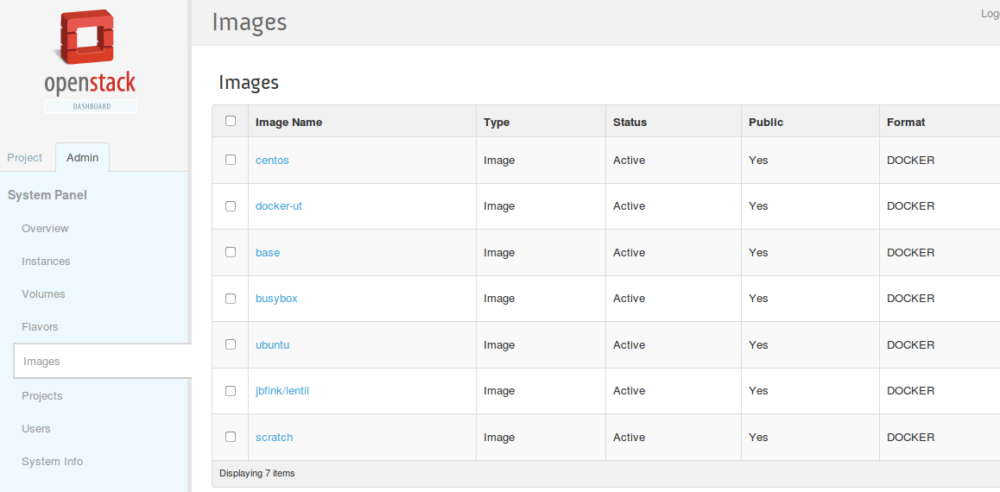
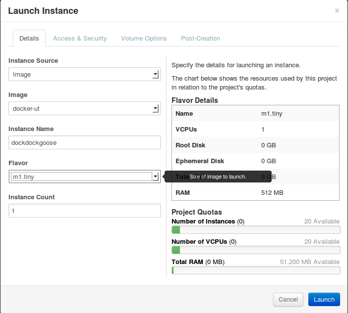

## Description ##

This repository is a test repo to get docker running on openstack in vagrant.

it pulls together resources from the following git repos :-

* https://github.com/rcbops/chef-cookbooks.git
* https://github.com/dotcloud/openstack-docker.git


## Building Docker on Openstack with Vagrant ##

Does the following: 

* Provisions a Ubuntu 12.04 VM
* Installs a Chef Server on it
* loads up all the recipes/roles/environment using spiceweasel/berkshelf
* runs chef-client to install openstack allinone node
* downloads the openstack-docker git repo
* installs the docker drivers

### Requirements ###

* vagrant 1.2.1 +
* vagrant plugin - vagrant-omnibus
* vagrant plugin - vagrant-berkshelf
* vagrant plugin - vagrant-cachier

### Usage ###

###### Get Started ######

```
git clone https://github.com/paulczar/docker-rcbops-openstack.git
cd docker-rcbops-openstack
vagrant up
```

###### See if it worked ######

go to https://33.33.33.50

* Username : admin
* Password : docker!






## License and Author ##

Author:: Paul Czarkowski (<paul@paulcz.net>)  

Copyright 2013, Paul Czarkowski

Licensed under the Apache License, Version 2.0 (the "License");
you may not use this file except in compliance with the License.
You may obtain a copy of the License at

    http://www.apache.org/licenses/LICENSE-2.0

Unless required by applicable law or agreed to in writing, software
distributed under the License is distributed on an "AS IS" BASIS,
WITHOUT WARRANTIES OR CONDITIONS OF ANY KIND, either express or implied.
See the License for the specific language governing permissions and
limitations under the License.

## Thanks To ##

Rackspace Cloud Builders Team
Dot Cloud ( makers of docker )